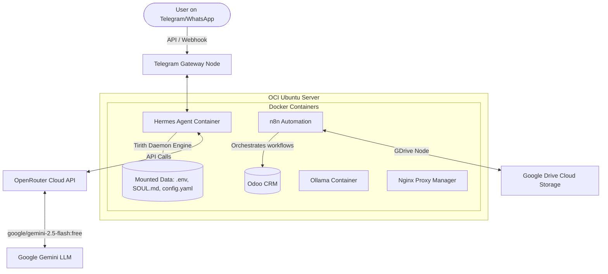

# 🤖 Agentic AI Workspace

This repository serves as the central control plane, configuration hub, and skill library for the AI Agents running on my OCI infrastructure, integrated with **Google Gemini Pro** and **n8n**.

It connects autonomous agent intelligence with Odoo ERP, Takaful insurance tools, and automated business workflows.

---

## 🏛️ The 5 Pillars of My Agentic Stack

This architecture is built on the 5 pillars of persistent, autonomous AI:

1. **Soul (`/agents/hermes/SOUL.md`)**: The identity, rules, and behavioral constraints of the agent (e.g. friendly sales rep, strategic planner).
2. **Memory (`/agents/hermes/memories/`)**: Contextual logs and customer details stored in Odoo and database files to maintain continuity.
3. **Skills (`/skills/`)**: Custom Python and API connector scripts that allow Gemini to:
   - **Odoo ERP**: Read and write business records.
   - **WhatsApp/Messaging**: Interface with customers to reply to leads.
   - **Web Tools**: Search and extract agricultural data for KebunData.
4. **Crons (`/workflows/cron-jobs/`)**: Automation tasks run on schedule via **n8n** (e.g., weekly CEO analysis, daily content generation).
5. **Self-Improvement**: Performance logging to refine sales scripts and copywriting.

---

## 🚀 Infrastructure Architecture

Our setup offloads heavy LLM computing to the cloud while keeping orchestration, security, and database systems private:



---

## 📂 Repository Layout

```text
agentic-ai-workspace/
├── README.md                 # Project dashboard and setup guide
├── .gitignore                # Block keys (.env, .pem), sheets, and PDFs
├── .env.example              # Environment variables template
│
├── agents/                   # Multi-agent configurations and system instructions
│   ├── ceo/                  # Business Planner Agent (Hormozi style)
│   ├── marketer/             # Social Copywriter Agent
│   ├── responder/            # WhatsApp/Telegram Lead Qualifier (Kamil)
│   └── farmer/               # AI Agronomist & IoT Advisor
│
├── docs/                     # Project Guides & Documentation
│   └── etiqa-marketer-setup.md # Guide for n8n + GDrive integration
│
├── skills/                   # Custom scripts the agent can execute
│   ├── generate_etiqa_content.py # Etiqa marketing copy generator
│   └── test_telegram.py      # Script to verify Telegram credentials
│
└── workflows/                # n8n Automation JSON blueprints
    ├── etiqa-marketer.json   # Google Drive + Gemini content pipeline
    └── ceo-reminder.json     # Scheduled proposal reminder via Telegram
```

