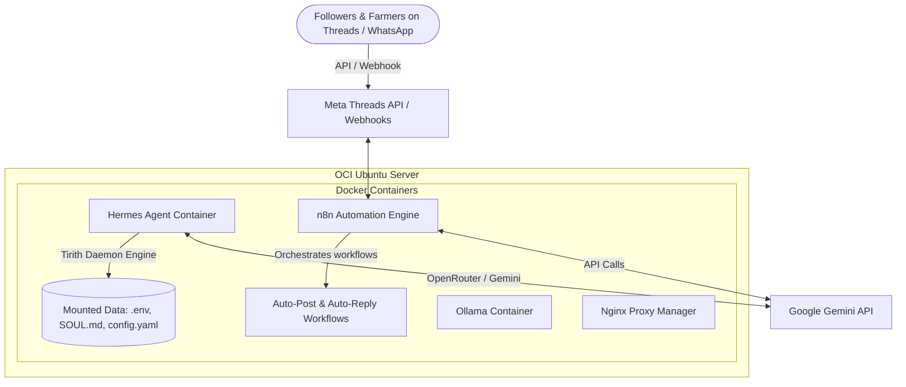

# 🤖 Agentic AI Workspace

This repository serves as the central control plane, configuration hub, and skill library for the AI Agents running on my OCI infrastructure, integrated with **Google Gemini Pro / Flash**, **n8n**, and **Meta Threads API**.

It connects autonomous agent intelligence with Odoo ERP, Takaful insurance tools, agricultural telemetry for KebunData, and automated social media growth engines.

---

## 🏛️ The 5 Pillars of My Agentic Stack

This architecture is built on the 5 pillars of persistent, autonomous AI:

1. **Soul (`/agents/*/SOUL.md`)**: The identity, rules, and behavioral constraints of the agents (e.g. Marketer, Agronomist, Growth Lead, Sales Qualifier).
2. **Memory (`/agents/hermes/memories/`)**: Contextual logs, engagement history, and customer details stored in Odoo and database files.
3. **Skills (`/skills/`)**: Custom Python and API connector scripts:
   - **Meta Threads API (`threads_client.py`)**: Publish viral posts, read replies, and execute automated conversational engagement loops.
   - **Content Generator (`generate_threads_content.py`)**: Multi-tier post & reply simulator using Gemini.
   - **Odoo ERP & Telegram**: Read/write business records and send automated alerts.
4. **Crons & Pipelines (`/workflows/`)**: Scheduled and event-driven workflows running in **n8n** (e.g., peak-hour social poster, 10-minute reply pollers).
5. **Self-Improvement**: Continuous refinement of hooks, engagement ratios, and reply retention.

---

## 🚀 Infrastructure Architecture



---

## 📂 Repository Layout

```text
agentic-ai-workspace/
├── README.md                          # Project dashboard and setup guide
├── .gitignore                         # Block keys (.env, .pem), sheets, and PDFs
├── .env.example                       # Environment variables template
│
├── agents/                            # Multi-agent configurations and system instructions
│   ├── ceo/                           # Business Planner Agent (Hormozi style)
│   ├── marketer/                      # General Social Copywriter Agent
│   ├── kebundata-threads/             # KebunData Threads Viral Marketer & Community Lead
│   ├── responder/                     # WhatsApp/Telegram Lead Qualifier (Kamil)
│   └── farmer/                        # AI Agronomist & IoT Advisor
│
├── docs/                              # Project Guides & Documentation
│   ├── etiqa-marketer-setup.md        # Guide for n8n + GDrive integration
│   └── kebundata-threads-setup.md     # Meta Threads API + Two-Tier Auto-Reply Setup Guide
│
├── skills/                            # Custom scripts the agent can execute
│   ├── generate_threads_content.py    # Two-tier Threads post & reply generator
│   ├── threads_client.py              # Official Meta Threads Graph API client
│   ├── generate_etiqa_content.py      # Etiqa marketing copy generator
│   └── test_telegram.py               # Script to verify Telegram credentials
│
└── workflows/                         # n8n Automation JSON blueprints
    ├── kebundata-threads-autopost.json  # Peak-time scheduled Threads viral poster
    ├── kebundata-threads-autoreply.json # Real-time Two-Tier comment responder & loop extender
    ├── etiqa-marketer.json            # Google Drive + Gemini content pipeline
    └── ceo-reminder.json              # Scheduled proposal reminder via Telegram
```
